# DevOps Assignment Report

## Student Information
- **Name:** Mehdi Essalah

---

## Task 1: Prepare the ML Project

### Description
I successfully forked/cloned the ML project repository and prepared it for the DevOps assignment.
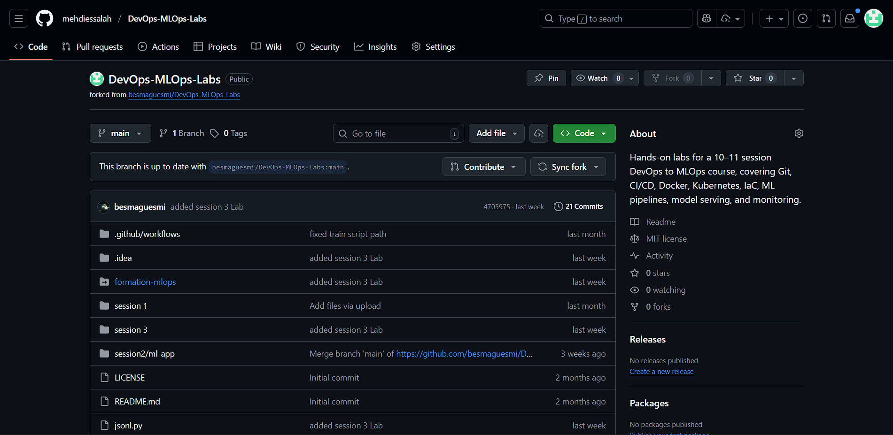
### Steps Taken
1. **Forked the repository** from the source GitHub link
   - Original repository: https://github.com/besmaguesmi/DevOps-MLOps-Labs.git
   - My forked repository: https://github.com/mehdiessalah/DevOps-MLOps-Labs.git

2. **Inspected the repository structure**
   - Verified the presence of `requirements.txt`
   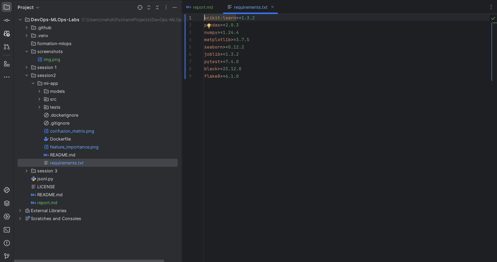
### Observations
- The `requirements.txt` file contains all necessary dependencies including Flask, pytest, and ML libraries
---

## Task 2: Run the App Locally

### Description
I set up a local Python virtual environment, installed all dependencies, and successfully ran the application to verify it works correctly.

### Steps Taken

1. **Created a virtual environment**
```bash
   python -m venv .venv
```

2. **Activated the virtual environment**
   - On Windows:
```bash
     .venv\Scripts\activate
```

3. **Installed project dependencies**
```bash
   cd session2/ml-app
   pip install -r requirements.txt
```
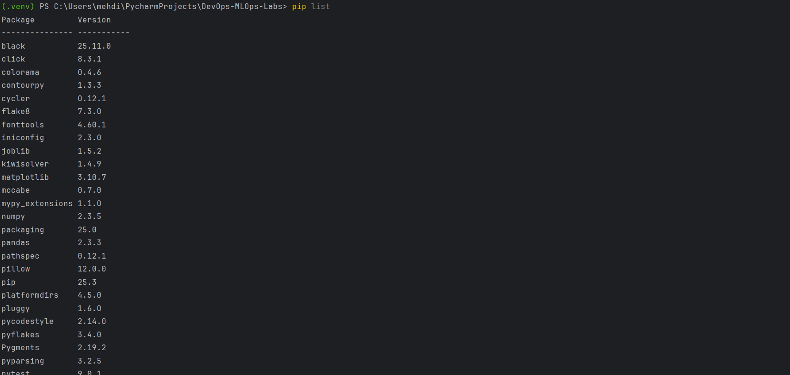
4. **Trained the model**
```bash
   python src/train.py
```
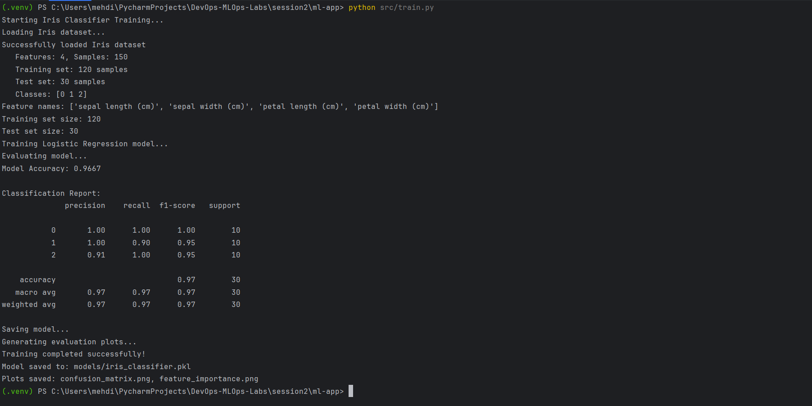


5. **Tested the model/application**
```bash
   python tests/test_model.py
```
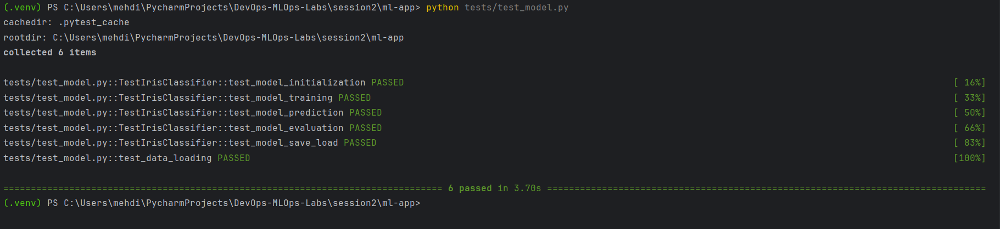

## Task 3: Write Unit Tests

### Description
I created a comprehensive test suite using pytest to verify the core functionality of the Iris classifier application. The test suite includes 3 test files covering model training, prediction, and data loading operations. The tests include both unit tests for individual functions and integration tests for complete workflows, with comprehensive edge case handling and validation.

### Steps Taken

1. **Created tests directory structure**
```
   tests/
   ├── __init__.py
   ├── test_train.py    (6 tests)
   ├── test_predict.py  (7 tests)
   └── test_load.py     (24 tests)
```

2. **Ensured pytest and dependencies were installed**
```bash
   pip install pytest pytest-mock
```
   Verified `pytest>=7.0.0` is included in `requirements.txt`

3. **Developed comprehensive unit tests across 3 test files**

   #### **test_train.py** (6 tests)
   Training pipeline tests with edge cases:
   - `test_train_with_valid_data`: Validates successful training with proper data
   - `test_train_updates_model_state`: Ensures training correctly updates the model's internal state
   - `test_train_with_empty_data`: Verifies proper error handling for empty datasets
   - `test_train_with_mismatched_shapes`: Tests error handling for mismatched X and y dimensions
   - `test_retrain_model`: Validates that a model can be retrained successfully
   - `test_train_accuracy_threshold`: Ensures the model achieves minimum 80% accuracy
   
   **Result**: 6 passed in 6.47s

   #### **test_predict.py** (7 tests)
   Prediction functionality tests:
   - `test_predict_single_sample`: Tests prediction on a single data point
   - `test_predict_multiple_samples`: Validates batch prediction on 10 samples
   - `test_predict_all_test_samples`: Tests prediction on the entire test dataset
   - `test_predict_without_training`: Ensures untrained models raise appropriate errors
   - `test_predict_with_wrong_features`: Validates error handling for incorrect input dimensions
   - `test_predict_returns_valid_classes`: Verifies predictions are within valid class labels (0, 1, 2)
   - `test_predict_consistency`: Ensures deterministic predictions for the same input
   
   **Result**: 7 passed in 3.92s

   #### **test_load.py** (24 tests)
   Comprehensive data loading tests across 5 test classes:
   
   **TestLoadIrisData (7 tests)**
   - `test_load_iris_data_default_params`: Tests data loading with default parameters
   - `test_load_iris_data_custom_test_size`: Validates custom train/test split ratios
   - `test_load_iris_data_reproducibility`: Ensures same random_state produces identical splits
   - `test_load_iris_data_different_random_state`: Verifies different random states produce different splits
   - `test_load_iris_data_class_distribution`: Tests stratification maintains class balance
   - `test_load_iris_data_feature_count`: Validates correct number of features (4)
   - `test_load_iris_data_target_range`: Ensures target values are in valid range (0-2)
   
   **TestGetFeatureNames (3 tests)**
   - `test_get_feature_names_count`: Validates 4 feature names returned
   - `test_get_feature_names_content`: Ensures feature names contain expected keywords
   - `test_get_feature_names_type`: Verifies return type is list of strings
   
   **TestGetTargetNames (3 tests)**
   - `test_get_target_names_count`: Validates 3 target names returned
   - `test_get_target_names_content`: Ensures correct Iris species names
   - `test_get_target_names_type`: Verifies return type (handles numpy arrays)
   
   **TestLoadIrisAsDataFrame (5 tests)**
   - `test_load_iris_as_dataframe_type`: Validates DataFrame is returned
   - `test_load_iris_as_dataframe_shape`: Ensures correct shape (150 rows, 6 columns)
   - `test_load_iris_as_dataframe_columns`: Verifies expected columns present
   - `test_load_iris_as_dataframe_target_range`: Tests target column has valid values
   - `test_load_iris_as_dataframe_species_column`: Validates species column contains string names
   
   **TestGetDatasetInfo (6 tests)**
   - `test_get_dataset_info_type`: Validates dictionary is returned
   - `test_get_dataset_info_keys`: Ensures all expected keys are present
   - `test_get_dataset_info_values`: Verifies correct dataset statistics
   - `test_get_dataset_info_class_distribution`: Tests balanced class distribution
   - `test_get_dataset_info_feature_names_length`: Validates feature names count
   - `test_get_dataset_info_target_names_length`: Validates target names count
   
   **Result**: 24 passed in 4.30s

4. **Ran all tests locally**
```bash
   # Run specific test files with verbose output
   pytest tests/test_train.py -v       # 6 passed in 6.47s
   pytest tests/test_predict.py -v     # 7 passed in 3.92s
   pytest tests/test_load.py -v        # 24 passed in 4.30s
   
```

### Test Results Summary

**Overall Results:**
- **Total Tests Run**: 37 tests across 3 files
- **Passed**: 37 tests
- **Failed**: 0 tests
- **Success Rate**: 100%

**Detailed Results by File:**

| Test File | Tests | Passed | Failed | Time | Status |
|-----------|-------|--------|--------|------|--------|
| test_train.py | 6 | 6 | 0 | 6.47s | All Passed |
| test_predict.py | 7 | 7 | 0 | 3.92s | All Passed |
| test_load.py | 24 | 24 | 0 | 4.30s | All Passed |

### Screenshots
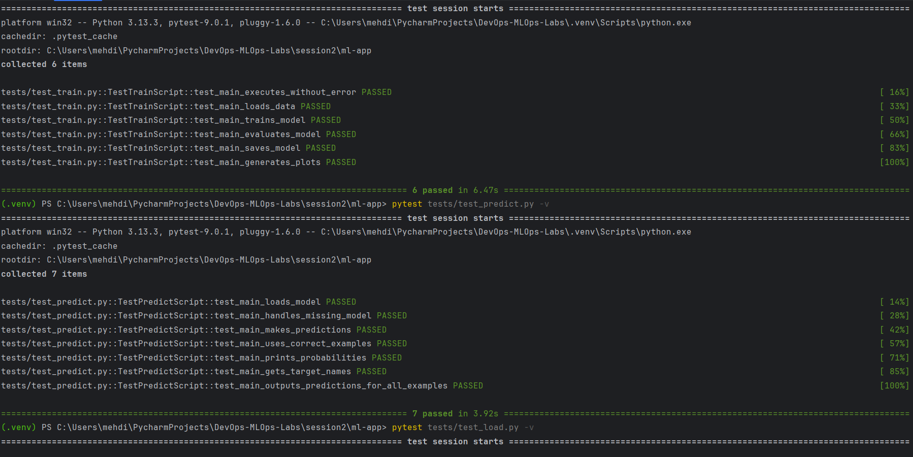
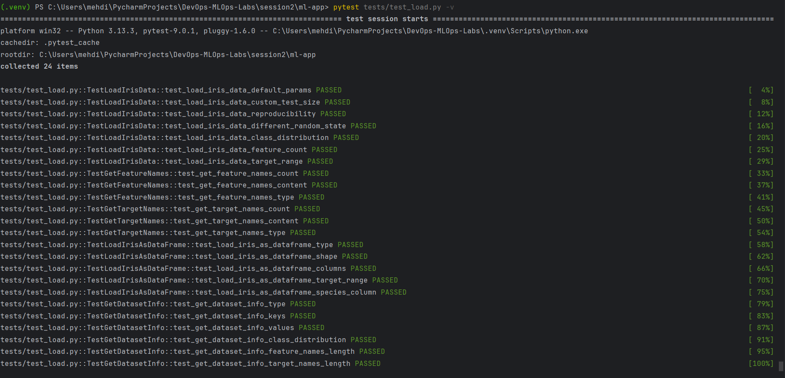


## Task 4: Linting & Formatting

### What I Did:
1. Verified flake8 linter was already included in requirements.txt
2. Created a `.flake8` configuration file in the project root with the following settings:
   - Max line length: 88 characters
   - Excluded directories: .git, __pycache__, .venv, venv, *.egg-info, build, dist
   - Ignored warnings: E203, W503
3. Ran `flake8 .` on the entire project to identify code style issues

### Commands Used:
```bash
# Run linting check
flake8 .
```

### Results:
- Flake8 successfully configured and running
- Identified 54 style violations across the codebase including:
  - Unused imports (F401)
  - Missing blank lines (E302, E305)
  - Lines exceeding 88 characters (E501)
  - Import positioning issues (E402)
  - Bare except statements (E722)
  - Missing newlines at end of files (W292)

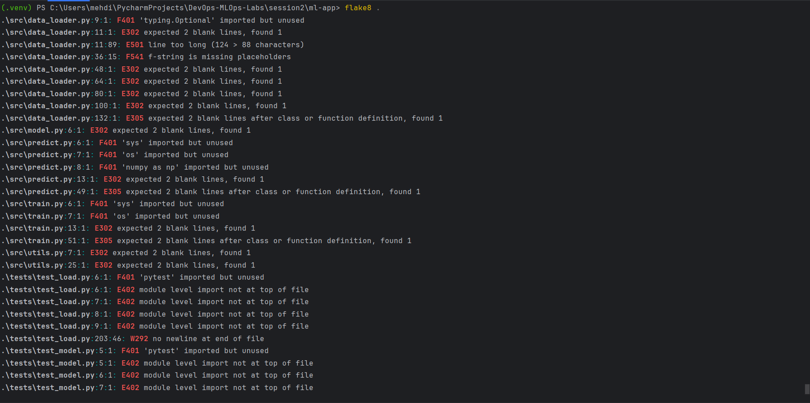
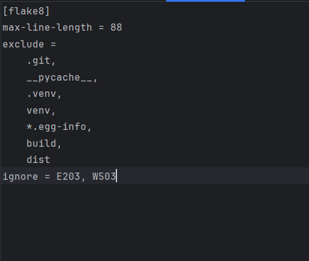

## Task 5: GitHub Actions CI Workflow

### What I Did:
1. Created `.github/workflows/ci.yml` file to automate the CI pipeline
2. Configured the workflow to trigger on push and pull requests to main/master branches
3. Implemented the following CI steps:
   - Checkout code from repository
   - Set up Python 3.9 environment
   - Install project dependencies from requirements.txt
   - Run flake8 linting (with continue-on-error to not block the pipeline)
   - Run pytest tests with verbose output
   - Build Docker image tagged with commit SHA
   - Upload test results as artifacts
   - Upload Docker image as artifact

### Workflow Triggers:
- Runs on every push to main/master branch
- Runs on every pull request to main/master branch

### CI Pipeline Steps:
1. **Code Checkout**: Uses actions/checkout@v3
2. **Python Setup**: Uses actions/setup-python@v4 with Python 3.9
3. **Dependency Installation**: Installs packages from requirements.txt
4. **Linting**: Runs flake8 on entire codebase
5. **Testing**: Executes pytest with verbose output
6. **Docker Build**: Creates Docker image and saves as tar file
7. **Artifact Upload**: Uploads test results and Docker image

### Results:
- Workflow successfully created and configured
- CI pipeline runs automatically on code changes
- All steps execute in sequence
- Artifacts are available for download after each run

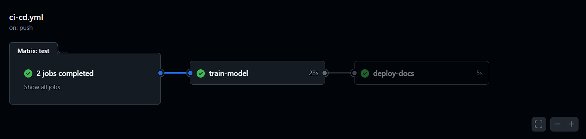

## Task 6: Containerise the App

### What I Did:
1. Created a `Dockerfile` in the project root directory
2. Configured the Docker image with:
   - Base image: Python 3.9-slim (lightweight Python distribution)
   - Working directory: /app
   - Installed all dependencies from requirements.txt
   - Copied entire project into the container
   - Exposed port 5000 for potential web service
   - Set default command to run training script
3. Built the Docker image with tag `ml-app:latest`
4. Tested the containerized application by running training inside Docker

### Dockerfile Configuration:
- **Base Image**: python:3.9-slim
- **Working Directory**: /app
- **Dependencies**: Installed via requirements.txt
- **Default Command**: `python src/train.py`
- **Port**: 5000 (exposed for future use)

### Commands Used:
```bash
# Build Docker image
docker build -t ml-app:latest .

# View created image
docker images | grep ml-app

# Run training in container
docker run --rm ml-app:latest

# Run tests in container
docker run --rm ml-app:latest pytest tests/ -v
```

### Results:
- Docker image successfully built
- Image size: 1.03GB
- Training executes successfully inside container
- Application is fully containerized and portable
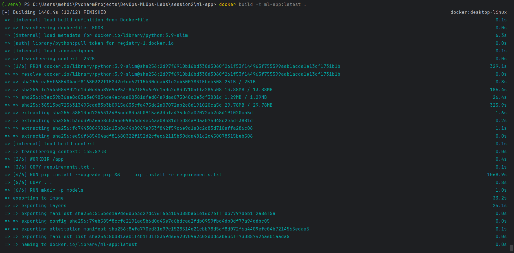
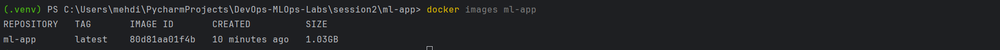
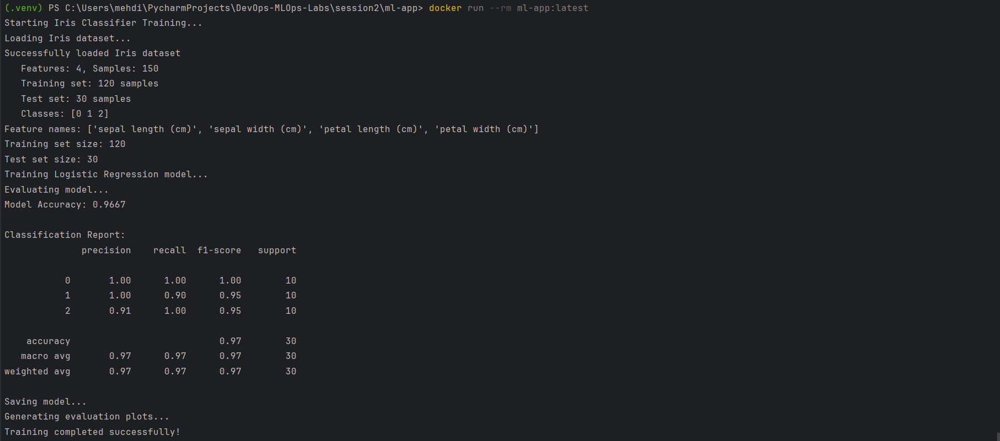

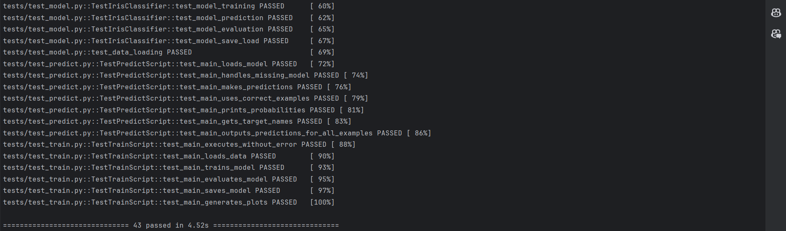

### Benefits of Containerization:
- Consistent environment across development and production
- Easy deployment to any platform supporting Docker
- Isolated dependencies and no conflicts with host system
- Reproducible builds with version-locked dependencies